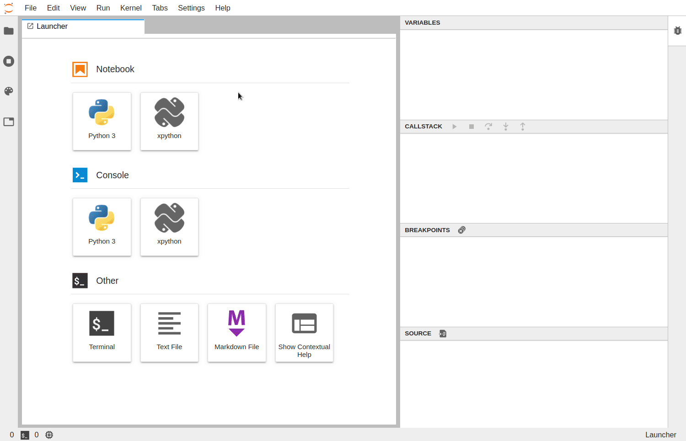

# @jupyterlab/debugger


[](https://mybinder.org/v2/gh/jupyterlab/debugger/stable?urlpath=/lab/tree/examples/index.ipynb)
[](https://www.npmjs.com/package/@jupyterlab/debugger)

A JupyterLab debugger UI extension. This extension is under active development.



## Prerequisites

- JupyterLab 2.0+
- xeus-python 0.8.0+
- notebook 6+

## Installation

A kernel with support for debugging is required to be able to use the debugger.

It is generally recommended to create a new `conda` environment to install the dependencies:

```bash
conda create -n jupyterlab-debugger -c conda-forge xeus-python=0.8.0 notebook=6 jupyterlab=2 ptvsd nodejs
conda activate jupyterlab-debugger
```

Then, run the following command to install the extension:

```bash
jupyter labextension install @jupyterlab/debugger
```

## Usage

For now `xeus-python` is the only Jupyter kernel that supports debugging. `xeus-python` can be selected from the JupyterLab launcher:


Alternatively, it is also possible to switch to the `xpython` kernel using the kernel selection dialog:


Enable the debugger, set breakpoints and step into the code:


## Development

```bash
# Create a new conda environment
conda create -n jupyterlab-debugger -c conda-forge nodejs xeus-python=0.8.0 ptvsd jupyterlab=2

# Activate the conda environment
conda activate jupyterlab-debugger

# Install dependencies
jlpm

# Build TypeScript source
jlpm build

# Link your development version of the extension with JupyterLab
jupyter labextension link .

# Rebuild TypeScript source after making changes
jlpm build

# Rebuild JupyterLab after making any changes
jupyter lab build

# Start JupyterLab with the kernel logs enabled and watch mode enabled
XEUS_LOG=1 jupyter lab --no-browser --watch
```

### Tests

To run the tests:

```bash
# [Optional] to enable the logs for xeus-python
export XEUS_LOG=1

jlpm run test
```

To run tests for a specific test suite name:

```bash
jlpm run test --testNamePattern=<regex>
```

To run tests for a specific test module name:

```bash
jlpm run test --testPathPattern=<regex>
```

### Inspecting debug messages

The [kernelspy extension for JupyterLab](https://github.com/vidartf/jupyterlab-kernelspy) can be used to inspect the debug messages sent between the debugger UI and the kernel.

To install it:

```bash
jupyter labextension install jupyterlab-kernelspy
```

### Debug Protocol Overview

Adding a quick overview of the debug protocol, so it's easier to visualize the types of messages sent between the JupyterLab extension and the kernel.

It only shows a subset of the messages for now, but can be extended to also include the calls to `continue`, `stepIn` and `disconnect`.

This also show new messages that are not part of the Debug Adapter Protocol (DAP), such as `dumpCell`.

#### Diagram


#### References

- Dump cell and state restoration: https://github.com/jupyterlab/debugger/issues/52
- Protocol Overview: https://microsoft.github.io/debug-adapter-protocol/overview
- Specification: https://microsoft.github.io/debug-adapter-protocol/specification

### Source

Generated using: https://bramp.github.io/js-sequence-diagrams/

<details><summary>Diagram source</summary>
<pre>
user->JupyterLab: open notebook

JupyterLab->kernel: kernel_info_request

kernel->JupyterLab: kernel_info_reply

JupyterLab->JupyterLab: check 'debugger' key

JupyterLab->user: show toggle button\nif 'debugger'

user->JupyterLab: enable debugging

JupyterLab->kernel: debugInfo request

kernel->JupyterLab: debugInfo response

user->JupyterLab: start debugger

JupyterLab->kernel: initialize request

kernel->JupyterLab: initialize response

JupyterLab->kernel: attach request

kernel->JupyterLab: attach response

Note right of kernel: debugger started

user->JupyterLab: add breakpoints\n(click on gutters)

JupyterLab->kernel: dumpCell request

kernel->JupyterLab: dumpCell response

JupyterLab->kernel: setBreakpoints request

kernel->JupyterLab: breakpoints response

JupyterLab->kernel: configurationDone request

kernel->JupyterLab: configurationDone response

user->JupyterLab: execute cell\n(Ctrl-Enter)

JupyterLab->kernel: requestExecute

kernel->kernel: execute code

kernel->kernel: hit breakpoint

kernel-->JupyterLab: stopped event

JupyterLab->kernel: stackTrace request

kernel->JupyterLab: stackTrace response

JupyterLab->user: show current line

JupyterLab->kernel: scopes request

kernel->JupyterLab: scopes response

JupyterLab->kernel: variables request

kernel->JupyterLab: variables response

JupyterLab->user: show variables

user->JupyterLab: step in deleted cell code

JupyterLab->kernel: stepIn request

kernel-->JupyterLab: stopped event

JupyterLab->JupyterLab: search for code matching\nsource path

JupyterLab->kernel: source request

kernel->JupyterLab: source response

JupyterLab->user: show source for current path

Note right of kernel: debug session

user->JupyterLab: disable debugging

JupyterLab->kernel: disconnect request

Note right of kernel: debugger stopped

kernel->JupyterLab: disconnect response

JupyterLab->JupyterLab: clear debugging UI for\nthe notebook
</pre>
</details>

### Inspecting Debug Messages in VS Code

Inspecting the debug messages in VS Code can be useful to understand when debug requests are made (for example triggered by a UI action), and to compare the behavior of the JupyterLab debugger with the Python debugger in VS Code.

#### Create launch.json

The first step is to create a test file and a debug configuration:


```json
{
    "version": "0.2.0",
    "configurations": [
        {
            "name": "Python: Current File",
            "type": "python",
            "request": "launch",
            "program": "${file}",
            "console": "integratedTerminal",
            "env": {"DEBUGPY_LOG_DIR": "/path/to/logs/folder"}
        }
    ]
}
```

#### Start the debugger


#### Open the logs

The content of the log file look like this:

```
...

D00000.032: IDE --> {
                "command": "initialize",
                "arguments": {
                    "clientID": "vscode",
                    "clientName": "Visual Studio Code",
                    "adapterID": "python",
                    "pathFormat": "path",
                    "linesStartAt1": true,
                    "columnsStartAt1": true,
                    "supportsVariableType": true,
                    "supportsVariablePaging": true,
                    "supportsRunInTerminalRequest": true,
                    "locale": "en-us"
                },
                "type": "request",
                "seq": 1
            }

...
```

With:

- `IDE` = VS Code
- `PYD` = pydev debugger
- Messages follow the DAP: https://microsoft.github.io/debug-adapter-protocol/specification

#### Overview


